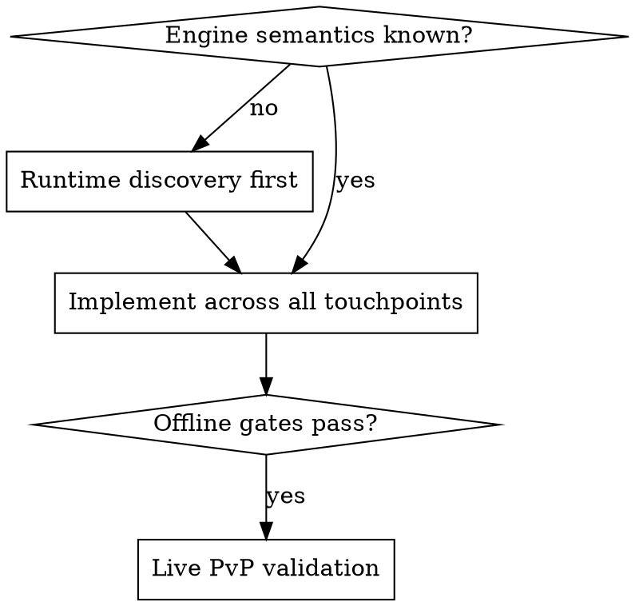

# Extending Broker Actions

## Overview

Broker capability changes follow a proven **vertical-slice discipline** (see vault `[[YGOMASTER-LLM-001]]` / `[[YGOMASTER-LLM-002]]` for completed examples under `/home/rakeenhuq/Onedrive/Obsidian Vault/projects/ygomaster/work/`). The order is non-negotiable because the expensive failures here are *engine-semantics guesses*: code that compiles, passes offline tests, and desyncs a live duel.

**REQUIRED BACKGROUND:** llm-broker-pipeline (invariants — especially hidden information and legality-in-engine).

## The slice discipline

1. **Runtime discovery first.** If the native behavior is unvalidated (how does the engine commit an N-pick list? what does `DLL_DuelGetCardFace` return live?), do a **log-only** run before writing control code: enable `LlmDecisionLogEnabled` with the broker *disabled*, play the scenario manually in a local PvP duel (use a deck engineered to force the window type you're studying), and read the `committed_action` events the existing hooks already record. Check the `DuelToEngineActType` enum in `Docs/updatediff.cs` first — it maps the engine's full action surface (e.g. `ListSendSelectMulti` exists alongside `ListSendIndex`), which tells you whether the flow uses an export the current hooks don't capture yet, meaning discovery needs a new log-only hook (hooking-il2cpp). This is exactly why multi-select and face-up identity exposure are currently out of scope — their semantics haven't been observed yet.
2. **Default-off flag.** New capability gets a `ClientSettings.json` flag, off in tracked source (e.g. pattern of `LlmBrokerEnabled`). Runtime enablement happens only via `prepare_llm_runtime.py`, never by editing tracked defaults (`--include-source-settings` exists but is deliberate).
3. **Fallback preserved.** Unsupported/failed cases must keep falling back to CPU. Never remove a fallback branch to "force" the new path.

## Touchpoint checklist (the full blast radius)

A new action kind or schema field touches, in implementation order:

| # | File | What |
|---|---|---|
| 1 | `YgoMasterServer/Llm/LegalActionTypes.cs` | Fields on `LegalAction`/`DecisionSnapshot` |
| 2 | `LegalActionExtractor.cs` | Enumerate the new actions (gate behind the new flag) |
| 3 | `LlmBrokerProtocol.cs` | Serialize request; parse/validate response. **Decide the `SchemaVersion` bump** — additive optional fields may keep v3, semantic changes bump it; either way fixtures reference it (see #8, #9) |
| 4 | `LlmActionCommitPlan.cs` | Map validated action → native call params |
| 5 | `LlmDecisionLogSerializer.cs` | Audit events for the new shape (every lifecycle step must stay reconstructable) |
| 6 | `YgoMasterClient/DuelDll.cs` | Commit path + flag threading (`TryStartLlmBrokerDecision`/`TryCommitLlmBrokerDecision`/`CommitLlmAction`) |
| 7 | `YgoMasterClient/ClientSettings.cs` + `YgoMaster/Data/ClientData/ClientSettings.json` | New default-off setting |
| 8 | `YgoMasterLlmTestHarness/Program.cs` | Add named checks (register in `Main`); update shape assertions that hardcode the schema. New engine reads also need fake-query plumbing: extend `ILegalActionQuery` + the harness fakes together |
| 9 | `Tools/llm_broker.py` + `Tools/test_llm_broker.py` | Prompt/JSON-schema, deterministic handler, strict parsing (reject bools-as-ints, dedupe candidates), self-test |
| 10 | `Tools/analyze_llm_duel_log.py` (+ its test) | Coverage counters so live validation can gate on the new action type |
| 11 | `Docs/LlmBroker.md` + vault work-item Progress | Operational schema docs in-repo; dated progress in vault `projects/ygomaster/work/` |

New `.cs` files additionally need `<Compile Include>` lines in **each** consuming csproj (old-style projects — see ygomaster-map).

Then run the full ladder in validating-changes, ending with a live PvP duel where `analyze_llm_duel_log.py --require-broker-action-type <new_kind>` passes.

## Design rules learned the hard way

- **`action_id` is a list index.** If your feature makes lists longer/more volatile, expect more `action_changed` rejections; validation compares full action structure (`IsSameAction`), so keep every distinguishing field serialized.
- **Public-state additions need the hidden-info test pair extended** (`DoesNotExposeHiddenPublicStateCards`, `DoesNotExposeOpponentHiddenHandCardMetadata`). If you can't write the "does not expose" test, you haven't defined the boundary.
- **Filter mechanical windows.** Anything with no strategic content (single option, forced actions) should auto-resolve or fall back — model calls are the scarce resource (pattern: `Look`/`Surrender`/forced `Draw`/single-option `Decide`).
- **Timeouts move together.** Provider timeout (`YGO_LLM_BROKER_PROVIDER_TIMEOUT` / CLI timeout) must stay below game `LlmBrokerTimeoutMs`; raise both when adding slow providers.
- **Broker parsing stays paranoid.** Balanced-JSON scanning, strict ints, last-match-wins on current seq, ambiguity → `provider_error`. Extend `parse_provider_decision` in that spirit; never trust wrapper text.

## Common mistakes

| Mistake | Reality |
|---|---|
| Implementing commit semantics from assumption | Step 1 exists because `DLL_DuelListSetIndex`-style calls have unobserved multi-call behavior. Observe first, code second. |
| Shipping the flag default-on | Every capability so far launched default-off and was flipped only for validation runs. |
| Updating C# but not `llm_broker.py`'s JSON schema/prompt | API providers validate against that schema; your new field silently never reaches the model. |
| Skipping the vault Progress entry | Vault work-item Progress is how the next session knows what was validated vs speculated. |
